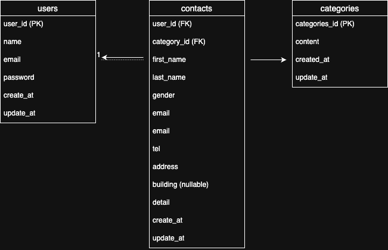

# Contact Form App
問い合わせフォームを管理者が操作できる Laravel アプリです。

---
## 環境構築　
```bash
git clone https://github.com/Hana86-86/contact-form-app
docker compose up -d --build     # 初回起動
docker compose exec app bash     # Laravelコンテナに入る
cp .env.example .env             # .env設定
php artisan key:generate         # キー生成
php artisan migrate --seed       # マイグレーション & シーディング

----

## 使用技術
	•	Laravel 8.x
	•	PHP 8.x
	•	MySQL
	•	Docker / Docker Compose
	•	Laravel Fortify（認証機能）
	•	Seeder / Factory（ダミーデータ生成）

----
## ER図


## URL
	•	開発環境：http://localhost:9001

----

## 概要（登録ページ）
	•	管理者画面にアクセスできる新規ユーザー作成
	•	バリデーションには FormRequest を使用
	•	ヘッダーの「login」ボタンクリックでログインページへ遷移
	•	「登録」ボタンクリックでバリデーションエラーがあると各項目下に表示

### バリデーションルール
	•	すべてのフォームが入力必須
- お名前を入力してください
- メールアドレスを入力してください
- パスワードを入力してください

	•	メールアドレスは ユーザー名@ドメイン 形式
- メールアドレスは「ユーザー名@ドメイン」形式で入力してください

----

##　概要（ログインページ）
	•	登録済みユーザーがログイン
	•	バリデーションには FormRequest を使用
	•	ヘッダーの「register」クリックで登録ページへ遷移
	•	バリデーションエラーがあると各項目下に表示
### バリデーションルール
    . 全てのフォームは入力必須

- メールアドレスを入力してください
- パスワードを入力してください

    .    メールアドレスは「ユーザー名@ドメイン」形式

- メールアドレスは「ユーザー名@ドメイン」形式で入力してください

----

## 概要（管理画面）	•	名前、メールアドレス、性別、カテゴリ、日付の検索（すべて OR 部分一致可）
	•	性別は「全て／男性／女性／その他」で選択
	•	日付はカレンダーで選択可能
	•	7件ごとのページネーション
	•	「リセット」ボタンで初期状態に戻す
	•	「詳細」ボタンでモーダル表示
	•	✅ 応用機能：
	•	CSVエクスポート（検索結果に絞った状態も可能）

---

## モーダルウィンドウ
	•	「詳細」はモーダルで表示
	•	「削除」でデータ削除
	•	「×」でモーダルを閉じる

## 機能概要（お問い合わせフォームの入力画面）
	•	姓・名分割入力
	•	性別：デフォルトで「男性」
	•	カテゴリ：デフォルトで「選択してください」
	•	「確認画面」ボタンで確認画面に遷移
	•	バリデーション：FormRequest 使用

### バリデーションルール
	•	※付きフォームはすべて必須
- 姓を入力してください
- 名を入力してください
- 性別を選択してください
- メールアドレスを入力してください
- 電話番号を入力してください
- 住所を入力してください
- お問い合わせの種類を入力してください
- お問い合わせ内容を入力してください
- お問い合わせ内容の入力文字数は120文字以内してください
- メールアドレスはメールアドレス形式

    ・メールアドレスはメール形式で入力してください

- 電話番号は半角数字、ハイフンなし
    ・電話番号は５桁までの数字で入力してください
    ・お問い合わせ内容は120文字いないで入力してください

## ダミーデータ作成
	•	Factoryで contacts に35件生成
	•	Seederで categories に5件生成：
1.商品のお届けについて
2.商品の交換について
3.商品のトラブル
4.ショップへのお問い合わせ
5.その他

## 機能概要（確認画面）
	•	入力したデータを表示
	•	姓と名の間にスペース挿入
	•	性別：ラベルに変換（男性／女性／その他）
	•	「修正」で入力画面へ戻る（値は保持）
	•	「送信」で contacts テーブルへ保存 → サンクスページへ遷移

## 機能概要（サンクスページ）
	•	「HOME」ボタンでお問い合わせフォームへ戻る


