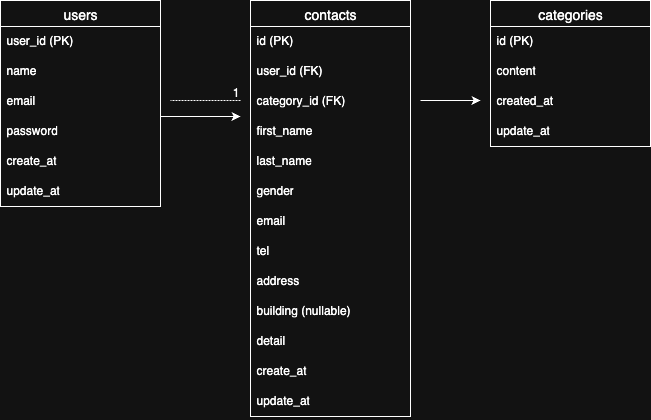

- Contact Form App

管理者がユーザーからのお問い合わせを管理できる Laravel アプリケーションです。
登録〜ログイン〜投稿〜検索〜CSV出力まで、一連のフローを学習・構築目的で実装しています。

⸻

- 環境構築手順

git clone https://github.com/Hana86-86/contact-form-app
cd contact-form-app
docker compose up -d --build

# Laravelコンテナに入る
docker compose exec app bash

# Laravel初期設定
cp .env.example .env
php artisan key:generate
php artisan migrate --seed

- 使用技術
	•	Laravel 10.x
	•	PHP 8.x
	•	MySQL
	•	Docker / Docker Compose
	•	Laravel Fortify（ログイン認証）
	•	Tailwind CSS（デザイン）
	•	Seeder / Factory（ダミーデータ生成）

- 開発用URL
	•	http://localhost:9001

## ER図



⸻

- 機能一覧

🔐 ユーザー登録・ログイン（Fortify）
	•	登録／ログイン画面を Fortify で構成
	•	バリデーションには FormRequest を使用
	•	日本語エラーメッセージ対応
	•	入力エラー時は各項目下にメッセージ表示

バリデーションルール例（register/login 共通）
	•	メールアドレスは 必須 / メール形式
	•	パスワードは 必須
	•	すべての入力項目が必須

⸻

- お問い合わせフォーム（入力 → 確認 → 完了）
	•	姓・名を分割入力、性別・カテゴリ選択付き
	•	バリデーションは FormRequest で実装
	•	電話番号は「半角数字／ハイフンなし」
	•	入力後は確認画面へ → 内容確認 → 送信でDB保存

バリデーションルール例
	•	必須項目：姓・名・性別・メール・電話・住所・カテゴリ・内容
	•	メール形式、120文字以内、電話は半角数字

⸻

- 管理画面（検索・一覧・CSV）
	•	フルネーム、性別、カテゴリ、日付で検索（部分一致対応）
	•	カレンダー入力による日付指定
	•	ページネーション（7件ずつ）
	•	結果をCSV形式でエクスポート可能
	•	検索リセットで全件表示に戻る
	•	各行に「詳細」ボタン → モーダルで内容表示

⸻

- モーダルウィンドウ
	•	「詳細」をクリックするとモーダルで内容表示
	•	「×」で閉じる、「削除」でデータ削除

⸻

- ダミーデータ
	•	Seeder & Factory 使用
	•	contacts：35件自動生成
	•	categories：
	1.	商品のお届けについて
	2.	商品の交換について
	3.	商品のトラブル
	4.	ショップへのお問い合わせ
	5.	その他

⸻

- トラブルと解決策

❌ 日本語バリデーションが表示されない
	•	原因：config/app.php で 'locale' => 'ja' にしても resources/lang/ja/validation.php が読み込まれていない
	•	解決：
	•	resources/lang/ja/validation.php を配置

❌ sessions テーブルが見つからないエラー

SQLSTATE[42S02]: Base table or view not found: 1146 Table 'contact_form.sessions' doesn't exist

	•	原因：.env に SESSION_DRIVER=database を設定しているが、セッション保存用テーブルが未作成

	•	解決：

php artisan session:table
php artisan migrate

🗂 その他
	•	Docker環境でのポートやマウントボリュームの設定は .env や docker-compose.yml に従う
	•	phpMyAdmin などを併用する場合は別途ポート設定が必要

❌ バリデーションエラーメッセージが表示されなかった原因と解決方法

❓ 発生した現象
	•	お問い合わせフォームに入力せず送信すると、**「このフィールドを入力してください」**というブラウザ標準のエラーが表示される。
	•	Laravelで定義した日本語のエラーメッセージ（例：「メールアドレスを入力してください」）が表示されなかった。

⸻

- 原因
	•	フォームの <input>, <select>, <textarea> に required 属性がついていた。
	•	required 属性があると、Laravelにリクエストが送られる前にブラウザ側のHTMLバリデーションで送信がブロックされるため、Laravelのバリデーションが発動しなかった。

⸻

- 解決方法

 1. required 属性をすべて削除

<!-- 修正前 -->
<input type="text" name="email" required>

<!-- 修正後 -->
<input type="text" name="email">

2. FormRequest クラスでルールとメッセージを定義
// app/Http/Requests/ContactRequest.php
```
public function rules(): array
{
    return [
        'email' => 'required|email',
        'tel' => 'required|digits_between:10,11',
        'address' => 'required|string',
        'category_id' => 'required|in:1,2,3,4,5',
        'detail' => 'required|string|max:2000',
    ];
}

public function messages(): array
{
    return [
        'email.required' => 'メールアドレスを入力してください',
        'tel.required' => '電話番号を入力してください',
        'address.required' => '住所を入力してください',
        'category_id.required' => 'お問い合わせの種類を選択してください',
        'detail.required' => 'お問い合わせ内容を入力してください',
    ];
}

 3. Bladeテンプレートでバリデーションエラーを表示
{{-- フォーム上部で全体エラー一覧を表示 --}}
@if ($errors->any())
  <div class="bg-red-100 text-red-700 p-4 mb-6 rounded">
      <ul>
          @foreach ($errors->all() as $error)
              <li>{{ $error }}</li>
          @endforeach
      </ul>
  </div>
@endif

{{-- 各フィールド下に個別エラーメッセージ表示 --}}
@error('email')
  <p class="text-red-500 text-sm">{{ $message }}</p>
@enderror

- 結果
	•	Laravelの FormRequest で定義した日本語のバリデーションメッセージが正しく表示されるようになった。
	•	フォームの上部と各入力フィールド下に、ユーザーに優しいエラーメッセージが表示されるようになった。

⸻
